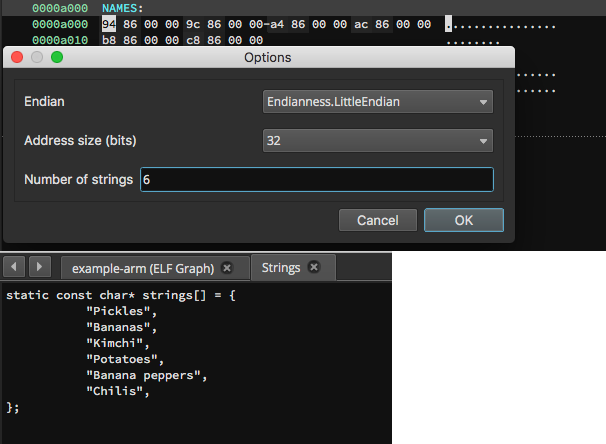

# String array viewer (v1.0 alpha)
Author: **Danny Rosseau**

_View the strings in an array at a given address as a C variable_

## Description:
Enumerates the string pointers at a given address. The address is treated as if it were a `const char**`. In some cases your array might end with a `NULL` address, in which case you can put the string length as -1 and it will keep reading addresses until `NULL` is reached.

## Minimum Version

This plugin requires the following minimum version of Binary Ninja:

 * release - 1.1.1038

## License
This plugin is released under a [MIT](LICENSE) license.
